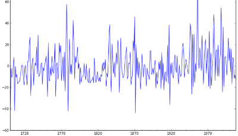

<u><h1>Technologies used:</h1></u>

* numpy
* matplotlib
* pandas
* statsmodels

<u><h1>Ouline:</h1></u>

* What is time series?
* Working with time series in pandas
* Manipulation with data
* Forecasting daily minimum temperature using ARIMA model

To run notebook use following command: 
`jupyter notebook HandlingTimeSeries.ipynb`